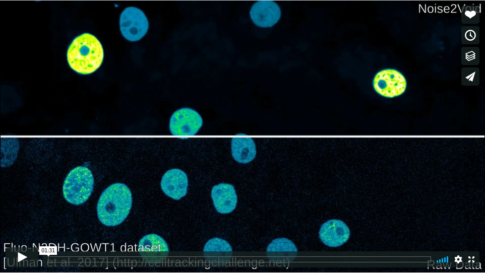

[](https://vimeo.com/305045007)

# Noise2Void - Learning Denoising from Single Noisy Images
Alexander Krull<sup>1,2</sup>, Tim-Oliver Buchholz<sup>2</sup>, Florian Jug
<sup>1</sup><code>krull@mpi-cbg.de</code>
<sup>2</sup>Authors contributed equally

The field of image denoising is currently dominated by discriminative deep learning methods that are trained on pairs of noisy input and clean target images. Recently it has been shown that such methods can also be trained without clean targets. Instead, independent pairs of noisy images can be used, in an approach known as NOISE2NOISE (N2N). Here, we introduce NOISE2VOID (N2V), a training scheme that takes this idea one step further. It does not require noisy image pairs, nor clean target images.  Consequently, N2V allows us to train directly on the body of data to be denoised and can therefore be applied when other methods cannot. Especially interesting is the application to biomedical image data, where the acquisition of training targets, clean or noisy, is frequently not possible.  We compare the performance of N2V to approaches that have either clean target images and/or noisy image pairs available. Intuitively, N2V cannot be expected to outperform methods that have more information available during training. Still, we observe that the denoising performance of NOISE2VOID drops in moderation and compares favorably to training-free denoising methods.

Paper: https://arxiv.org/abs/1811.10980

Our implementation is based on [CSBDEEP](http://csbdeep.bioimagecomputing.com) ([github](https://github.com/csbdeep/csbdeep)).

## Installation
This implementation requires [Tensorflow](https://www.tensorflow.org/install/).
We have tested Noise2Void on LinuxMint 18.3 using python 3.6 and tensorflow-gpu 1.12.0.
Once tensorflow in installed, you can clone the repository:
```
git clone https://github.com/juglab/n2v.git
```
Change into its directory and install it:
```
cd n2v
pip install -e .
```
You are now ready to run Noise2Void.

## How to use it?
Have a look at our jupyter notebook:
* [2D example](https://github.com/juglab/Noise2Void/blob/N2V_integration/examples/noise2void/N2V_denoising2D.ipynb)


